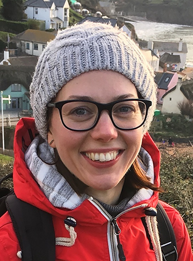
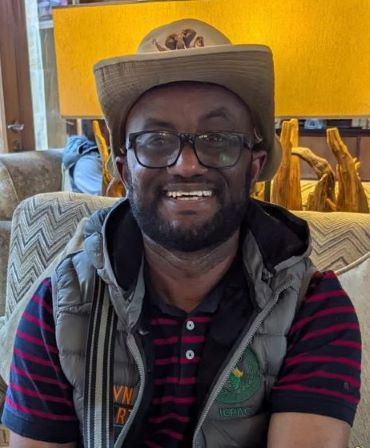
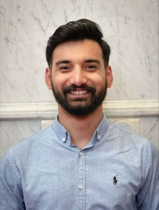

## Research Group Leader

{:class="img-responsive"} 
[Katerina Michaelides]()

## Project Support

{:class="img-responsive"} 
[Lauren Brown](), Project Support for DOWN2EARTH project.  

## Current Postdocs

{:class="img-responsive"} 
[Dagmawi Asfaw](), Research Associate (Main Advisor), funded by EU Horizon 2020 Project Down2Earth (_2023-25_)  

{:class="img-responsive"} 
[Andrés Quichimbo](), Research Associate (co Advisor), funded by EU Horizon 2020 Project Down2Earth (_2021-25_)   (based at Cardiff University)

{:class="img-responsive"} 
[Manuel Rios Gaona](), Research Associate (co Advisor), funded by EU Horizon 2020 Project Down2Earth (_2021-25_)   (based at Cardiff University)

{:class="img-responsive"} 
[Muhammad Ali](), Research Associate (Main Advisor), funded by EU Horizon 2020 Project Down2Earth (_2024-25_)  

## Current PhD Students 
#### (Katerina's role in parentheses)

 
{:class="img-responsive"} 
[George Blake](), PhD (Primary Supervisor), NERC GW4 DTP Studentship (Met Office CASE)  
**Thesis: Convective-scale predictions of climate impacts on the water balance in East African drylands** (_2022-_)

{:class="img-responsive"} 
[Katherine Cocking](), PhD (Co-Supervisor), Cardiff University Scholarship  
**Thesis: Impacts of projected future climate change in the Horn of Africa drylands** (_2021-_)

## Visiting PhD Students

 
{:class="img-responsive"} 
[Ying Hu](), Visiting PhD student (Feb-Aug 2024), University of Bristol, China Scholarship Council (CSC) scholarship  
**Project while in Bristol: Analysing vegetation responses to climate in East African drylands**

## Past Postdocs

 
{:class="img-responsive"} 
[David MacLeod](), Senior Research Assoicate, funded by EU Horizon 2020 Project Down2Earth (_2020-23_)  

{:class="img-responsive"} 
[Jacob Rigby](), Research Assoicate, funded by EU Horizon 2020 Project Down2Earth (_2023-24_)  

   
## Past Graduate Students (PhD and Masters)

{:class="img-responsive"} 
[Isaac Kipkemoi](), PhD (Primary Supervisor), Kenyan Government Scholarship  
**Thesis: Detecting signatures of drought in vegetation of East Africa** (_2018-2024_)

{:class="img-responsive"} 
[Tamsin Lockwood](), PhD (Primary Supervisor, taken over from Jim Freer in 2019)  
**Thesis: Quantifying the efficacy of in-situ Natural Flood Management (NFM)** (_2017-2022_)

{:class="img-responsive"} 
[Shiuan-An Chen](), PhD (Primary Supervisor)  
**Thesis: Climatic controls on river topography** (_2016-2021_)

[Eleanor Hansford](https://www.linkedin.com/in/eleanorhansford/?originalSubdomain=uk), MSc (Primary Supervisor)   
**Thesis: Recent precipitation changes in East Africa and their relation to groundwater** (_2018-19_)

[Rory Hollings](https://www.linkedin.com/in/rory-hollings-piema-assocrtpi-6a2712146/?originalSubdomain=uk), MScR (Primary Supervisor)  
**Thesis: How do rainstorms shape dryland river basins?** (_2014-2017_)

[Thom Turpin-Jelfs](http://www.bristol.ac.uk/geography/people/thomas-c-turpin-jelfs/index.html), PhD (Primary Supervisor)  
**Thesis: Impacts of environmental change on the soil nitrogen pool in emerging and degrading arid ecosystems.** (_2014-2019_)

[Alice Charteris](https://repository.rothamsted.ac.uk/staff/84218/alice-charteris), PhD (2nd Supervisor)  
**Thesis: 15N tracing of microbial assimilation, partitioning and transport of fertilisers in grassland soils.** (_2013-2017_)

Rebecca Harrison, PhD (Primary Supervisor)  
**Thesis: An Investigation of Spatial and Temporal of Pesticide Dynamics at the Catchment Scale.** (_2011-2014_)

[Charlotte Lloyd](http://www.bris.ac.uk/chemistry/people/charlotte-e-lloyd/index.html), PhD (Primary Supervisor)  
**Thesis: Experimental investigations of the effects of hydrological and erosion processes on the transport and fate of livestock-derived organic matter.** (_2007-2011_)

[Debbie Lister](https://www.eunomia.co.uk/person/dr-debbie-fletcher/), PhD (Primary Supervisor)  
**Thesis: Small-Scale Erosion-Driven Nutrient Dynamics in Different Vegetation Communities in Jornada, New Mexico: Implications for Land Degradation.** (_2004-2007_)

Gareth Martin, PhD (Primary Supervisor)  
**Thesis: Investigating the effects of hillslope-channel coupling on sediment transport in semi-arid areas.** (_2001-2005_)

<image src="/assets/images/Group_photo_CrescentIsland_30_10_24.jpg" alt="group">
<figcaption>Group on Crescent Island, Naivasha, Kenya, during D2E General Assembly 30th Oct 2024.</figcaption>

<image src="/assets/images/Group_photo_Hellsgate_31_10_24.jpg" alt="group">
<figcaption>Group at Hellsgate gorge, Kenya during D2E General Assembly 31st Oct 2024.</figcaption>

<image src="/assets/images/Group_photo_Maa_1_11_24.jpg" alt="group">
<figcaption>Group at Maa Trust House, Maasai Mara on 1st Nov 2024.</figcaption>

<image src="/assets/images/Mara_image.jpg" alt="group">
<figcaption>Katerina with Maasai women doing beadwork at the Maa Trust on 1st Nov 2024.</figcaption>

<image src="/assets/images/Group_photo_Mara_2_11_24.jpg" alt="group">
<figcaption>Group during game drive at Maasai Mara on 2nd Nov 2024.</figcaption>

<image src="/assets/images/Group_photo_Bob_3_11_24.jpg" alt="group">
<figcaption>Group with awesome driver Bob in Nairobi after safari, 3rd Nov 2024.</figcaption>

<image src="/assets/images/Group_photo_VOX_23_9_24.jpg" alt="group">
<figcaption>Group at VOX coaching session 23 September 2024, with the VOX master himself, Pete Bailie.</figcaption>

<image src="/assets/images/Group_photo_4_2_22_vox.jpg" alt="group">
<figcaption>Group at VOX coaching session 4th Feb 2022.</figcaption>

